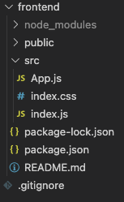

Connecting the frontend to the backend can be a little intimidating, particularly for newer programmer's, so I wanted to write this step by step guide on how all these pieces connect with one another.

For our stack we will be using React for the frontend, node.js for our backend & mongodb for our database.

<h3>Setup & Installation</h3>

We will setup the frontend first using create react app. Run the following code in your terminal, make sure you are in a directory where you want this project to live. I am calling mine react-node-mongodb-template

 

Once that finishes installing, move to the newly created directory and run rm -rf .git in your terminal.
We want our git to be in the root of the project, if this was just a frontend app you would not need to do this.
Also you will have a .gitignore file in your frontend directory, move that up one directory into your root.

 

 

Now in .gitignore add node_modules, nodemodules/ & .env. We will have one node_modules for our server & one in our frontend. We also do not want any sensitive data getting pushed to our github repo's, so we add .env to the ignore file. Your .gitignore should look like this.

 

Next let's intialize are git. Make sure you do this in the root, run the following in your terminal.

 

Let's do some cleanup in our frontend src file. Delete the following highlighted files.

 

You should be left with the following:

 

<h3>Backend Setup</h3>

For now, let's leave the frontend & create our backend. In the root, create a directory called backend.

 

While remaining in your root run npm init in the terminal. Edit the entry point from index.js to server.js

This will generate a package.json file in our root. Now we can install some dependencies we will be using. Run the following in your terminal:

 

Now let's add nodemon & concurrently as dev dependencies

 

Add the following under your scripts in the package.json file. The "magical" one is dev, as you can see when we run npm run dev, concurrently allows us to run our server file & our frontend file at the same time.

 

Let's create our server file. In the backend directory create server.js

 

Bring in the following code to your server.js file. We bring in express(node.js framework we are using), dotenv, so we can store our environment/sensitive variable's, initialize our connectDB function which will connect to our database, productRoutes which will have our routes we will hit from the frontend, they will have controllers which will be responsible for fetching the data from our mongodb & sending it back to the UI, more on that later. 

 

Now we are going to create our config directory, the place where our db connection will live. Type the following in your terminal:

 

Inside the db.js file put in the below code, this will establish the connection to the db. As you can see the MONGO_URI is kept in the .env file, since this is what is used to connect to your database, you do not want this to be public.

 

Now let's create the .env file. In your root run the following in your terminal:

 

Inside your .git file add the variable's below.

 

<h3>Setting up the mongo database</h3>

Let's start setting up the db, go to create your db, if you do not have a mongo account you can create one for free.
<a href="https://www.mongodb.com/" target= "_blank" rel="noopener noreferrer">mongodb</a>

 

Once you logged into your account, you want to create a cluster, this usually takes 1-3 minutes. After you cluster has been created, go to Database Access under the Security tab & click on Add New Database User.

 

Once you have added the user, in this case yourself, go to Network Access & click on Add IP Address, allow access from anywhere is fine for developement purposes. Under your cluster tab select collection's, this will be empty be default. Click on add my own data, for this example I am using the collection with the name products. 

 

Now that we have a collection created, click on the connect option under your Clusters tab, then click on Connect your application. Then copy your connection string.

 

Now in your .env file make a MONGO_URI variable & set the value to your connection string, & replace the pass & db name with your pass & db name you created.

 

<h3>Backend Routes</h3>

Now we will get started creating our routes, these routes are simply Rest API's that our frontend can call & get any data we want from our server & or database.

In your backend directory create a routes directory & inside routes create a productRoutes file. This is where we will define our product routes.

 

In your productRoutes file enter in the below code. We are bringing in express router so we can create the routes & we bring in our controllers that will run once the route is hit, we will create the controllers right after this.

 

<h3>Backend Controllers</h3>

We will create the product controller now, controllers are responsible for holding the logic that fetches, updates, creates, or deletes the data from our mongo database.

 

Inside productController we will make functions that get all the products, get a single product, delete a single product, & create a single product. See the below code:

 

 

As you can see, we are using a model of Product, this simply a mongoose schema that defines the shape of the documents within our collection.

<h3>Setting up the db model</h3>

Let's begin creating our mongoose schema. In your backend directory run the following in the terminal:

 

Then in your productModel file add the below code. Our collection will take a name, brand & price value.

 

<h3>Finishing up with the frontend</h3>

Let's revisit the frontend & make some react components, routes & hook up some css. First we will install axios for our api calls & react-router-dom for our frontend routes. Run the following in your terminal:

 

We will quickly hook up some bootstrap css, via their cdn. In your index.html file enter in the bootstrap cdn in the head tag. The cdn can be found <a href="https://getbootstrap.com/docs/4.3/getting-started/introduction/" target= "_blank" rel="noopener noreferrer" class="text-info">Here</a> Your index.html file should look something like this:

 

Now we need to make sure our frontend can communicate with our server. To do this we can simply add one line to our package.json that is in our frontend package.json file. By adding a proxy that targets our local host & the specified port that our server is running on, mine is 5000, your's might be different so if you get an error with this, just double check the port your server is running on. See below:

 

Now let's start making some component's & set up some route's. When using react router dom you can wrap all the routes you want in the BrowserRouter, in this project I renamed it to Router. Inside the Router tag we can specify each route we want to create, then the component that is going to render once that route is visited. Add the below code to your App.js file.

 

Now let's make the Home component. In your src directory make a components directory & a Home.js file in components.

 

In the Home.js file we will use the useEffect hook that will run when the component first renders to get all our products from the server. We make the call using axios. Then we use the useState hook to store the data we get back in our component state object.

 

Now that we have our products data we can loop through the array using the map method & print it out on our UI. You could do this in the main return in the Home function using a ternary operator, but instead we will create a renderProducts function that will then be brought into the main return, it will be a cleaner looking syntax this way.

 

As you can see there is a Link tag which is just react's very own anchor tag for internal routes. We have one wrapped around the item's name which will hit the product/:id route which in our App.js file renders a component called Product.
The other Link takes us to /create which renders a component called Create, which we will make next.

In your components directory make a file called Create.js

 

In Create.js we will have a form that when submitted will hit our post product route & run the createProduct controller. We will set the input data into our state, when we submit the form we will use e.preventDefault() so the page does not reload, once the axios post is sent we will be redirected to the home page, by using history.push which we destructure out of our default props. See below:

 

Then we create our form, when submitted will call our submitHandler function. As you can see there is a GoBack component within our return. This is just a reusable component that returns a link that redirects us to the home page.

 

Let's create this reusable GoBack component. In your components directory make a file called GoBack.js

 

In your GoBack file write in the following code:

 

Now let's make our last component, it will be called Product.js. This is the component that will show the specified product, the route is /product/:id. So we destructure out match from our default props to access the id within our URL/params. In our useEffect we fetch the product using axios that hits the getProductById controller. We then set the response in our product state. In Product.js see the following code:

 

We will have a delete option in this component that will hit the deleteProduct controller & remove the product from our database. Once that is submitted our removed state will be set to true, in which case the removed message will appear, then redirect us back to the home page. For production apps using tost notifications is more ideal, for simplicity of this guide I am just using a piece of state along with a setTimeout method that returns our removed message. See the below code:

 

<h3>Conclusion</h3>

This guide should have given you a good idea on how to connect the frontend to the backend, how to pull data from an API & how the routes, controller's & database fit into the puzzle. I wanted to make this pretty bare bones so this could be a good starting template for anyone's next react,node,mongodb app. This repo will be hosted on github, you can find it here: <a href="https://github.com/Iinguistics/react-nodejs-mongodb-template" target= "_blank" rel="noopener noreferrer" class="text-info">Repo </a>All you would need to do to get up & running, is clone the repo, npm intall, make your .env file, make your mongodb account & paste in your mongoURI into your .env file & you are good to go.

